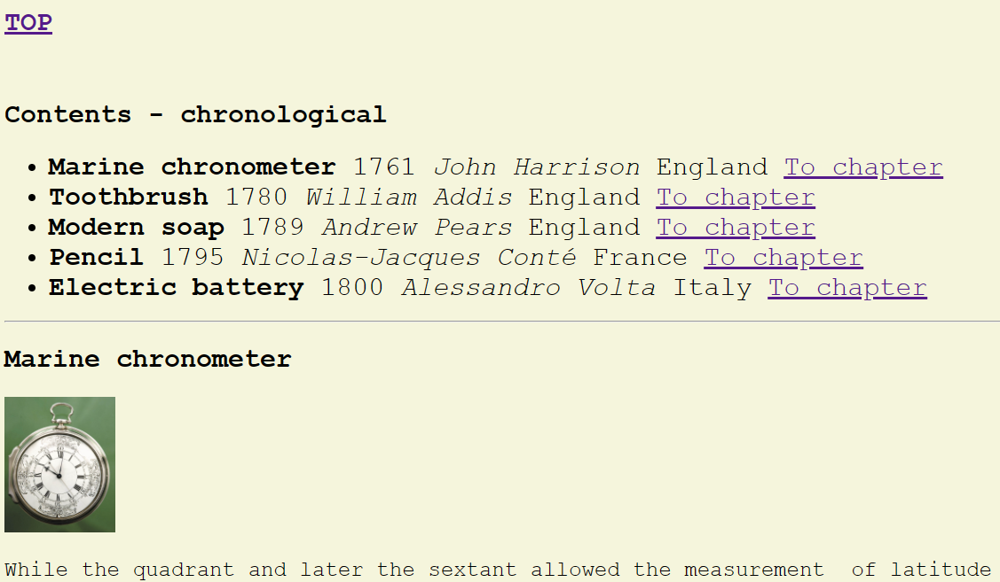
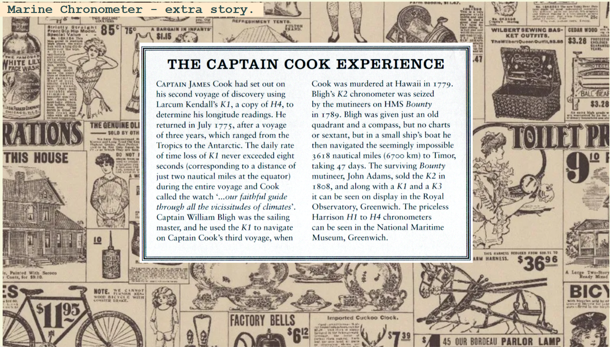
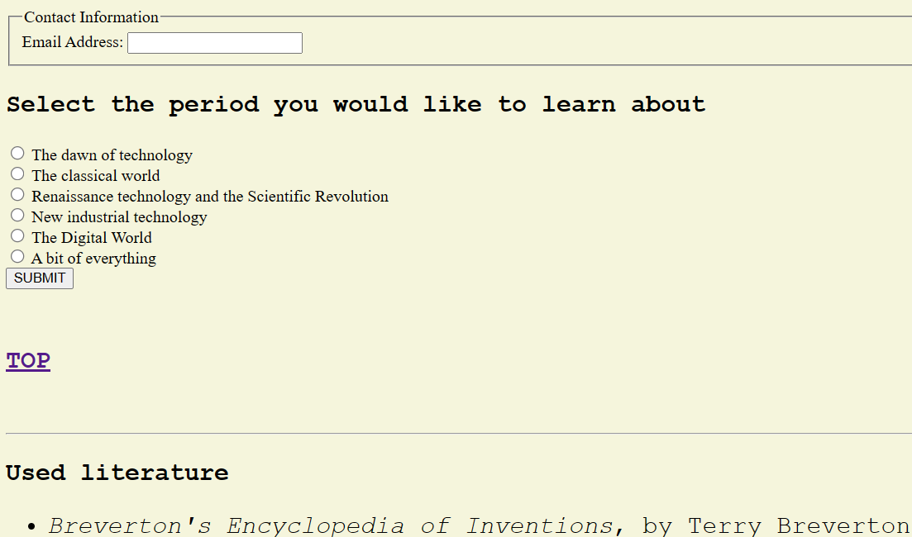
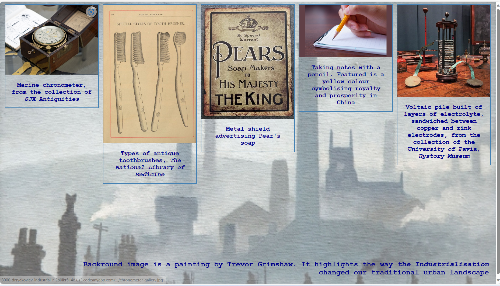

# Industrial Revolution Inventions

## Introduction

This little project is telling the story of some very useful things invented during the exciting period in modern history known to us as an Industrial Revolution (1760-1840). It is difficult to overestimate a significance of technical development which occured during that period of time. The present project tells about some inventions we use every day and take for granted (except for a marine chronometer, which enabled safe navigation, great geographical discoveries and global trade). You will learn a bit about personalities beyond each invention and, of course the story of success when each invention was commerciolised. The project tells about five objects only - a drop in the ocean. We would require a serios research work to unvail this prolific period. The page contains main text, links to corresponding pages on Wikipedia (opened in separate tabs) and to little magazine or newspaper notes which a curious mind will find interesting. For a better experience use a full-screen pc to browse. Finally, the page has a form where you can choose what else you would like to learn about history of technology.

## Top navigation bar

The section helps to quickly move to manin parts of the project, i.e. list of contents, main chapters, gallery and feedback form.

## Main page

Main page contains external links, navigation links and also links to the internal pages with magazine and newspaper notes.

## Feedback form

Below the main content one can find a feedback informing the author regarding other periods in the technology development hystory the reader would like to learn.

## Gallery

The project contains the Gallery section with high-quality images of described inventions.

## Interactivity

The main page and gallery rearrange formatting to accommodate smaller screen size. The corresponding icons expand to reveal better view of an artefact.

## Testing

During the development of the project, Microsoft Edge browser was mostly used. The test was also run on Chrome platform. No issues e.g. broken links were discovered.

## Bugs

All bugs were discovered and fixed prior to submission of the project.

## Validation

The html and css codes passed W3C and Jigsaw validator with no residual/unresolved issues
Lighthouse tool came out with high scores for acessibility (97%), best practices (100%), SEO (90%) and medium performance (51 %). In the latter case, size/resolution of some pictures needs to be further optimised.

## Deployment

The project was deployed to GitHub Pages.

## Credits

The textual content was partially taken from Breverton's Enciclopaedia of Inventions and Electrochemical Science Advances (see list of references, main page). Image of Hogwarts Express was taken from wallpapers.com. Only media available for free download were used. <https://watchesbysjx.com> and Royal Museum Greenwich <https://www.rmg.co.uk/> sources were used to illustrate the Marine Chronometer section; <https://circulatingnow.nlm.nih.gov/> website of National Library of Medicine and Gresham Family Dentistry <https://greshamfamilydentistry.com/> sourses were used to obtain pictures for the Toothbrush section; Soap advertisement street metal shield image was taken from the British Metal Signs company <https://circulatingnow.nlm.nih.gov/>. Morning Coach <https://www.morningcoach.com/> website was used as a surce of illustrations for the Pencil section. Battery images were taken from corresponding Wikipedia article and Duracell. In writing code, <https://www.w3schools.com/>, <https://developer.mozilla.org/en-US/> and <https://stackoverflow.com/> were used. Ultimately, I am grateful immensely to my beloved wife for her support and encouragement.
